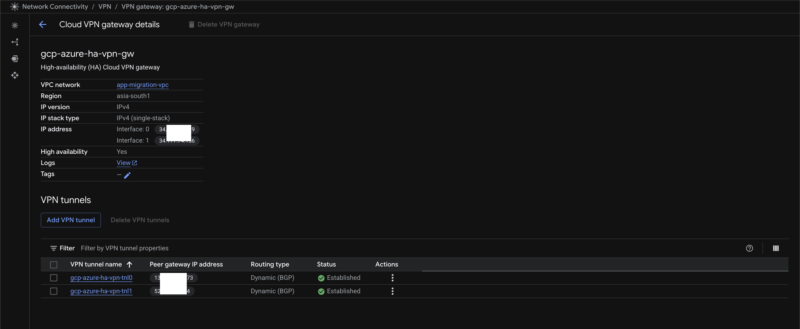
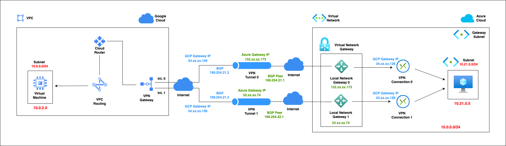

# Bridge the Clouds: A Practical Walkthrough for Connecting Azure and GCP

### Nomenclatures

| Terms | Description             |
| ----- | ----------------------- |
| BGP   | Border Gateway Protocol |
| CLI   | Command Line Interface  |
| GCP   | Google Cloud Platform   |
| HA    | High Availability       |
| NSG   | Network Security Group  |
| VM    | Virtual Machine         |
| VNET  | Virtual Network         |
| VPC   | Virtual Private Cloud   |
| VPN   | Virtual Private Network |


## Introduction

Building a multi-cloud or hybrid cloud infrastructure is a growing trend, and connecting different cloud environments securely is a crucial step. This article provides a comprehensive guide on establishing a Virtual Private Network (VPN) gateway between **Microsoft Azure** and **Google Cloud Platform (GCP)**. We'll walk you through the essential configurations on both sides, ensuring a secure and reliable connection for your resources.

This deep dive will cover:

- **Setting up the Azure Virtual Network Gateway**: Learn how to create and configure the necessary components in Azure, including the Virtual Network, Gateway Subnet, and Local Network Gateway.

- **Configuring the GCP Cloud VPN Tunnel**: We'll detail the steps for setting up a Classic VPN on GCP, including creating the VPN gateway and peer gateway.

- **Connecting the Two Environments**: This section will show you how to finalise the connection by specifying the public IP addresses and shared keys on both platforms.

  

## Objectives

The objective of this article is to provide a detailed, step-by-step guide for network administrators, cloud architects, and DevOps engineers on how to successfully establish a secure, site-to-site VPN connection between Microsoft Azure and Google Cloud Platform (GCP).

By the end of this article, you will be able to:

- **Understand the core concepts** of VPN gateways, peer connections, and routing in both Azure and GCP.
- **Confidently configure and deploy** an Azure Virtual Network Gateway and a GCP Classic VPN gateway.
- **Successfully establish a secure IPsec tunnel** to enable private communication between resources in an Azure VNet and a GCP VPC.
- **Troubleshoot common connectivity issues** by examining configuration examples and key parameters such as public IP addresses, shared keys, and routing tables.

This guide aims to move beyond a basic overview, offering deep-dive examples and explanations that will empower you to create a robust and reliable multi-cloud network infrastructure.

## What it contains...

- A Route-based Classic VPN setup between Azure and GCP with an example
- A BGP-based Dynamic HA VPN setup between Azure and GCP with an example

## What it does not...

- This document is not a tutorial on the general VPN process or the underlying concepts of virtual private networking. For foundational knowledge, please consult the [References](#References) section.

- It does not serve as a tutorial for any of the specific GCP services or tools utilised in this solution. Users are expected to have a working knowledge of these components; please refer to the [References](#References) section.

  

## Let's delve into it!

### Pre-requisites

- #### GCP

  - **gcloud CLI** - Used to setup the end to end Infrastructure on GCP.
    - [Install the gcloud CLI](https://cloud.google.com/sdk/docs/install)

  - Or, **GCP Cloud Shell**
    - [Run gcloud commands with Cloud Shell](https://cloud.google.com/shell/docs/run-gcloud-commands)

- #### Azure

  - **azure CLI** - Used to setup the end to end Infrastructure on Azure.
    - [Install the azure CLI](https://learn.microsoft.com/en-us/cli/azure/install-azure-cli?view=azure-cli-latest)

  - Or, **Azure Cloud Shell**
    - [Run azure commands with Cloud Shell](https://learn.microsoft.com/en-us/azure/cloud-shell/get-started/classic?tabs=azurecli)


## Classic VPN Gateway

### High Level Architecture


## Step-by-Step guide on Azure

Here is a step by step guide on how to deploy this entire infrastructure end to end on Azure.

> [!TIP]
>
> - The following set of commands are for Azure and hence should be run within [azure CLI](#Azure) or [Azure Cloud Shell](#Azure).
> - If you are using VSCode or similar IDEs then create a separate terminal within the IDE for Azure.

### Setup CLI environment variables in azure CLI

```bash
RESOURCE_GROUP=gcp-vpn-poc
LOCATION=centralus
CLASSIC_VPN_VNET_NAME=vpn-vnet
CLASSIC_VPN_VNET_ADDRESS_PREFIX=10.20.0.0/16
CLASSIC_VPN_VM_SUBNET_NAME=vm-subnet
CLASSIC_VPN_VM_SUBNET_ADDRESS_PREFIX=10.20.0.0/24
CLASSIC_VPN_MIGRATION_NSG=vpn-nsg
CLASSIC_VPN_MIGRATION_NSG_ALLOW_SSH=vpn-nsg-allow-ssh
CLASSIC_VPN_MIGRATION_NSG_ALLOW_HTTPS=vpn-nsg-allow-https
CLASSIC_VPN_MIGRATION_NSG_ALLOW_GCP_IP0=vpn-nsg-gcp-allow-ip0
CLASSIC_VPN_GATEWAY_SUBNET_NAME=GatewaySubnet
CLASSIC_VPN_GATEWAY_SUBNET_ADDRESS_PREFIX=10.20.1.0/24
CLASSIC_GATEWAY_PUBLIC_IP1=azure-gcp-vpn-gw-pub-ip-1
CLASSIC_GATEWAY_PUBLIC_IP2=azure-gcp-vpn-gw-pub-ip-2
CLASSIC_AZURE_VPN_GATEWAY_NAME=azure-gcp-vpn-gw
CLASSIC_LOCAL_GATEWAY_NAME=azure-gcp-local-vpn-gw
CLASSIC_VPN_CONNECTIN_NAME=azure-gcp-vpn-conn
CLASSIC_GCP_VPN_GATEWAY_IP=<TBD>

GATEWAY_TYPE=Vpn
GATEWAY_SKU=VpnGw2
GATEWAY_GENERATION=Generation2
VPN_TYPE=RouteBased
GCP_SUBNET_IP=10.0.0.0/24
SHARED_SECRET=z2e4LGcANtfvADzAlRpRxxBrsoocYvRj
MIGRATION_SOURCE_VM_NAME=vpn-source-vm
MIGRATION_SOURCE_VM_NAME1=vpn-source-vm1
```

> [!Note]
>
> - Variable names are only as an example.
> - **CLASSIC_GCP_VPN_GATEWAY_IP** will be set later.
> - **CLASSIC_VPN_GATEWAY_SUBNET_NAME** should be named as **GatewaySubnet**

### Authenticate to Azure

```bash
az login
az account subscription list
```

### Let's setup Network for Classic VPN

```bash
az network vnet list -g $RESOURCE_GROUP -o table

#Create VNET
az network vnet create -n $CLASSIC_VPN_VNET_NAME --address-prefixes $CLASSIC_VPN_VNET_ADDRESS_PREFIX -g $RESOURCE_GROUP
#az network vnet delete -n $CLASSIC_VPN_VNET_NAME -g $RESOURCE_GROUP

#Create Subnet for VMs to test the connectivity
az network vnet subnet create -n $CLASSIC_VPN_VM_SUBNET_NAME --address-prefixes $CLASSIC_VPN_VM_SUBNET_ADDRESS_PREFIX \
--vnet-name $CLASSIC_VPN_VNET_NAME -g $RESOURCE_GROUP
#az network vnet subnet delete -n $CLASSIC_VPN_VM_SUBNET_NAME --vnet-name $CLASSIC_VPN_VNET_NAME -g $RESOURCE_GROUP

#Create Subnet for VPN gateway; should be named as GatewaySubnet
az network vnet subnet create -n $CLASSIC_VPN_GATEWAY_SUBNET_NAME --address-prefixes $CLASSIC_VPN_GATEWAY_SUBNET_ADDRESS_PREFIX \
--vnet-name $CLASSIC_VPN_VNET_NAME -g $RESOURCE_GROUP
#az network vnet subnet delete -n $CLASSIC_VPN_GATEWAY_SUBNET_NAME --vnet-name $CLASSIC_VPN_VNET_NAME -g $RESOURCE_GROUP
```


### Add Network Security Groups for the VNET

```bash
az network nsg create -n $CLASSIC_VPN_MIGRATION_NSG -g $RESOURCE_GROUP
#az network nsg delete -n $CLASSIC_VPN_MIGRATION_NSG -g $RESOURCE_GROUP

az network nsg rule create --name $CLASSIC_VPN_MIGRATION_NSG_ALLOW_SSH --nsg-name $CLASSIC_VPN_MIGRATION_NSG \
--source-address-prefixes "*" --source-port-ranges "*" \
--destination-address-prefixes $CLASSIC_VPN_VM_SUBNET_ADDRESS_PREFIX --destination-port-ranges 22 \
--priority 100 --direction Inbound --access Allow --protocol TCP -g $RESOURCE_GROUP
#az network nsg rule delete --name $CLASSIC_VPN_MIGRATION_NSG_ALLOW_SSH --nsg-name $CLASSIC_VPN_MIGRATION_NSG -g $RESOURCE_GROUP

az network nsg rule create --name $CLASSIC_VPN_MIGRATION_NSG_ALLOW_HTTPS --nsg-name $CLASSIC_VPN_MIGRATION_NSG \
--source-address-prefixes "*" --source-port-ranges "*" \
--destination-address-prefixes $CLASSIC_VPN_VM_SUBNET_ADDRESS_PREFIX --destination-port-ranges 80 443 \
--priority 101 --direction Inbound --access Allow --protocol TCP -g $RESOURCE_GROUP
#az network nsg rule delete --name $CLASSIC_VPN_MIGRATION_NSG_ALLOW_HTTPS --nsg-name $CLASSIC_VPN_MIGRATION_NSG -g $RESOURCE_GROUP

az network nsg rule create --name $CLASSIC_VPN_MIGRATION_NSG_ALLOW_GCP_IP0 --nsg-name $CLASSIC_VPN_MIGRATION_NSG \
--source-address-prefixes $GCP_SUBNET_IP --source-port-ranges "*" \
--destination-address-prefixes $CLASSIC_VPN_VM_SUBNET_ADDRESS_PREFIX --destination-port-ranges "*" \
--priority 102 --direction Inbound --access Allow -g $RESOURCE_GROUP
#az network nsg rule delete --name $CLASSIC_VPN_MIGRATION_NSG_ALLOW_GCP_IP0 --nsg-name $CLASSIC_VPN_MIGRATION_NSG -g $RESOURCE_GROUP
```

### Create Classic VPN Gateway on Azure

```bash
#Create Public IP 1
az network public-ip create -n $CLASSIC_GATEWAY_PUBLIC_IP1 --version IPv4 --sku Standard -g $RESOURCE_GROUP
#az network public-ip delete -n $CLASSIC_GATEWAY_PUBLIC_IP1 -g $RESOURCE_GROUP

#Create Public IP 2
az network public-ip create -n $CLASSIC_GATEWAY_PUBLIC_IP2 --version IPv4 --sku Standard -g $RESOURCE_GROUP
#az network public-ip delete -n $CLASSIC_GATEWAY_PUBLIC_IP2 -g $RESOURCE_GROUP

#Create VPN Gateway with Public IP 1 and Public IP 2
az network vnet-gateway create -n $CLASSIC_AZURE_VPN_GATEWAY_NAME -g $RESOURCE_GROUP\
--vnet $CLASSIC_VPN_VNET_NAME --gateway-type $GATEWAY_TYPE \
--vpn-type $VPN_TYPE --sku $GATEWAY_SKU --vpn-gateway-generation $GATEWAY_GENERATION \
--public-ip-address $CLASSIC_GATEWAY_PUBLIC_IP1 $CLASSIC_GATEWAY_PUBLIC_IP2
#az network vnet-gateway delete -n $CLASSIC_AZURE_VPN_GATEWAY_NAME -g $RESOURCE_GROUP

#Check the status of the VPN Gateway creation
az network vnet-gateway list -g $RESOURCE_GROUP
```

> [!TIP]
>
> - Azure VPN Gateway will be created with two public IP Addresses - **Public IP 1** and **Public IP 2**
> - Please note these down as they would be needed later while setting up the VPN Gateway on the GCP side.


## Let's now shift our attention to GCP

## Step-by-Step guide on GCP

Here is a step by step guide on how to deploy this entire infrastructure end to end on GCP.

> [!TIP]
>
> - The following set of commands are for GCP and hence should be run within [gcloud CLI](#GCP) or [GCP Cloud Shell](#GCP).
> - If you are using VSCode or similar IDEs then create a separate terminal within the IDE for GCP.

### Setup CLI environment variables in gcloud CLI

```bash
SERVICE_ACCOUNT_FILE_PATH=<Path of the Google Service Account Key file>
PROJECT_ID=<PROJECT-ID>
OWNER=<GCP ID of a Admin User>
GSA_DISPLAY_NAME=<DIsplay Name of the Google Service Account>
GSA=$GSA_DISPLAY_NAME@$PROJECT_ID.iam.gserviceaccount.com
REGION=asia-south1
VPC_NAME=app-vpn-vpc
VM_SUBNET=vm-subnet
TEST_VPN_VM=test-vpn-vm
CLASSIC_VPN_GATEWAY_NAME=gcp-azure-classic-vpn-gw
CLASSIC_VPN_GATEWAY_IP_NAME=gcp-azure-vpn-gw-pub-ip
CLASSIC_TUNNEL_NAME_IF0=gcp-azure-vpn-tnl0
CLASSIC_TUNNEL_ROUTE0=gcp-azure-vpn-tnl-rt0
AZURE_GW_IP_0=<VPN Gateway IP0>
AZURE_GW_IP_1=<VPN Gateway IP1>
AZURE_SUBNET_IP_RANGE0=10.20.0.0/24

IKE_VERS=2
SHARED_SECRET=z2e4LGcANtfvADzAlRpRxxBrsoocYvRj
MASK_LENGTH=30
```

> [!NOTE]
>
> - Variable names are only as an example.
> - **AZURE_GW_IP_0**: First Public IP of the [Azure VPN Gateway](#Create Classic VPN gateway on Azure) created above.
> - **AZURE_GW_IP_1**: Second Public IP of the [Azure VPN Gateway](#Create Classic VPN gateway on Azure) created above.
> - **AZURE_SUBNET_IP_RANGE0**: Should not overlap with the IP ranges of **VM_SUBNET** on GCP.

### Authenticate user to gcloud

```bash
gcloud auth login
gcloud auth list
gcloud config set account $OWNER
```

### Setup current project

```bash
gcloud config set project $PROJECT_ID

gcloud services enable cloudresourcemanager.googleapis.com
gcloud services enable compute.googleapis.com

gcloud config set compute/region $REGION
gcloud config set compute/zone $ZONE
```

### Setup Service Account

Current authenticated user will handover control to a **Service Account** which would be used for all subsequent resource deployment and management

```bash
gcloud iam service-accounts create $GSA_DISPLAY_NAME --display-name=$GSA_DISPLAY_NAME
gcloud iam service-accounts list

# Make GSA as the owner
gcloud projects add-iam-policy-binding $PROJECT_ID --member=serviceAccount:$GSA --role=roles/owner

# ServiceAccountUser role for the SA
gcloud projects add-iam-policy-binding $PROJECT_ID --member=serviceAccount:$GSA --role=roles/iam.serviceAccountUser

# ServiceAccountTokenCreator role for the SA
gcloud projects add-iam-policy-binding $PROJECT_ID --member=serviceAccount:$GSA --role=roles/iam.serviceAccountTokenCreator
```

### Setup Network

```bash
gcloud compute networks create $VPC_NAME --subnet-mode=custom --bgp-routing-mode=regional --mtu=1460
#gcloud compute networks delete $VPC_NAME

gcloud compute networks subnets create $VM_SUBNET --network=$VPC_NAME \
--range=10.0.0.0/24 
#gcloud compute networks subnets delete $VM_SUBNET

gcloud compute networks subnets list --network=$VPC_NAME
```

### Setup Firewall Rules

```bash
gcloud compute firewall-rules create allow-vpn-egress --allow=all --destination-ranges=0.0.0.0/0 \
--direction=EGRESS --network=$VPC_NAME --priority=100
gcloud compute firewall-rules delete allow-vpn-egress

gcloud compute firewall-rules create allow-vpn-http-ingress --allow=tcp:80,tcp:443 --source-ranges=0.0.0.0/0 \
--direction=INGRESS --network=$VPC_NAME --priority=101
#gcloud compute firewall-rules delete allow-vpn-http-ingress

gcloud compute firewall-rules create allow-vpn-ssh --allow=tcp:22 --source-ranges=0.0.0.0/0 \
--direction=INGRESS --network=$VPC_NAME --priority=102
#gcloud compute firewall-rules delete allow-vpn-ssh

gcloud compute firewall-rules create allow-azure-vpn-conn --allow=tcp --source-ranges=10.20.0.0/24 \
--direction=INGRESS --network=$VPC_NAME --priority=103
#gcloud compute firewall-rules delete allow-azure-vpn-conn

gcloud compute firewall-rules create allow-vpn-gcp-health-check --network=$VPC_NAME \
--action=allow --direction=INGRESS --source-ranges=130.211.0.0/22,35.191.0.0/16 \
--rules=tcp --priority=104
#gcloud compute firewall-rules delete allow-vpn-gcp-health-check

gcloud compute firewall-rules  list --format="table(name, network)" --filter="network=$VPC_NAME"
```

### Setup Cloud VPN Gateway

```bash
gcloud compute addresses create $CLASSIC_VPN_GATEWAY_IP_NAME
gcloud compute addresses describe $CLASSIC_VPN_GATEWAY_IP_NAME --format="get(address)"
#gcloud compute addresses delete $CLASSIC_VPN_GATEWAY_IP_NAME

gcloud compute target-vpn-gateways create $CLASSIC_VPN_GATEWAY_NAME --network $VPC_NAME
#gcloud compute target-vpn-gateways delete $CLASSIC_VPN_GATEWAY_NAME

gcloud compute forwarding-rules create vpn-1-rule-esp \
--address=$(gcloud compute addresses describe $CLASSIC_VPN_GATEWAY_IP_NAME --format="get(address)") \
--ip-protocol=ESP --target-vpn-gateway=$CLASSIC_VPN_GATEWAY_NAME
#gcloud compute forwarding-rules delete vpn-1-rule-esp

gcloud compute forwarding-rules create vpn-1-rule-udp500 \
--address=$(gcloud compute addresses describe $CLASSIC_VPN_GATEWAY_IP_NAME --format="get(address)") \
--ip-protocol=UDP --ports=500 --target-vpn-gateway=$CLASSIC_VPN_GATEWAY_NAME
#gcloud compute forwarding-rules delete vpn-1-rule-udp500

gcloud compute forwarding-rules create vpn-1-rule-udp4500 \
--address=$(gcloud compute addresses describe $CLASSIC_VPN_GATEWAY_IP_NAME --format="get(address)") \
--ip-protocol=UDP --ports=4500 --target-vpn-gateway=$CLASSIC_VPN_GATEWAY_NAME
#gcloud compute forwarding-rules delete vpn-1-rule-udp4500

gcloud compute vpn-tunnels create $CLASSIC_TUNNEL_NAME_IF0 --peer-address=$AZURE_GW_IP_0 --shared-secret=$SHARED_SECRET \
--ike-version=$IKE_VERS --local-traffic-selector=0.0.0.0/0 --remote-traffic-selector=0.0.0.0/0 \
--target-vpn-gateway=$CLASSIC_VPN_GATEWAY_NAME
#gcloud compute vpn-tunnels delete $CLASSIC_TUNNEL_NAME_IF0

gcloud compute routes create $CLASSIC_TUNNEL_ROUTE0 --network=$VPC_NAME --priority=100 \
--destination-range=$AZURE_SUBNET_IP_RANGE0 --next-hop-vpn-tunnel=$CLASSIC_TUNNEL_NAME_IF0
#gcloud compute routes delete $CLASSIC_TUNNEL_ROUTE0
```


### Setup the Test VM

```bash
gcloud compute instances create $TEST_VPN_VM \
--zone=$REGION-a --machine-type=n2d-standard-2 \
--image-family=ubuntu-2204-lts --image-project=ubuntu-os-cloud \
--network=$VPC_NAME --subnet=$VM_SUBNET \
--scopes=https://www.googleapis.com/auth/cloud-platform
#gcloud compute instances delete $TEST_VPN_VM

gcloud compute ssh $TEST_VPN_VM --zone=$REGION-a

#Install a simple nginx server for testing
sudo apt update
sudo apt get nginx
```

> [!NOTE]
>
> - We will use this Test VM to test end to end VPN connectivity between Azure and GCP.
> - The VM can be of any configuration of your choice; above setup is just an example.


## Let's go back to Azure

### Complete the rest of the setup

```bash
CLASSIC_GCP_VPN_GATEWAY_IP=<Public IP of the CLassic VPN GATEWAY on GCP>

az network local-gateway create -n $CLASSIC_LOCAL_GATEWAY_NAME -g $RESOURCE_GROUP \
--local-address-prefixes $GCP_SUBNET_IP --gateway-ip-address $CLASSIC_GCP_VPN_GATEWAY_IP 
#az network local-gateway delete -n $CLASSIC_LOCAL_GATEWAY_NAME -g $RESOURCE_GROUP

az network vpn-connection create --name $CLASSIC_VPN_CONNECTIN_NAME -g $RESOURCE_GROUP \
--vnet-gateway1 $CLASSIC_AZURE_VPN_GATEWAY_NAME --local-gateway2 $CLASSIC_LOCAL_GATEWAY_NAME --shared-key $SHARED_SECRET
#az network vpn-connection delete --name $CLASSIC_VPN_CONNECTIN_NAME -g $RESOURCE_GROUP
```


### Setup the Test VM

```bash
az vm create -g $RESOURCE_GROUP -n $MIGRATION_SOURCE_VM_NAME --image Ubuntu2204 \
--admin-username azureuser --admin-password P@ssword@2025 --vnet-name $CLASSIC_VPN_VNET_NAME --subnet $CLASSIC_VPN_VM_SUBNET_NAME \
--authentication-type password --generate-ssh-keys --size Standard_D2s_v3 --location $LOCATION
#az vm delete -g $RESOURCE_GROUP -n $MIGRATION_SOURCE_VM_NAME

#Connct to the VM
az ssh vm --local-user azureuser -g $RESOURCE_GROUP -n $MIGRATION_SOURCE_VM_NAME

#Install a simple Apache server for testing
sudo apt update
sudo apt install apache2
```

> [!NOTE]
>
> - We will use this Test VM to test end to end VPN connectivity between Azure and GCP.
> - The VM can be of any configuration of your choice; above setup is just an example.


### How to test the setup end to end?


#### In azure CLI

```bash
#Connct to the VM
az ssh vm --local-user azureuser -g $RESOURCE_GROUP -n $MIGRATION_SOURCE_VM_NAME

#This should return the nginx welcome page
curl http://<GCP_TEST_VM_IP>
```

#### In gcloud CLI

```bash
#Connct to the VM
gcloud compute ssh $TEST_VPN_VM --zone=$REGION-a

#This should return the Apache welcome page
curl http://<AZURE_TEST_VM_IP>
```


## HA VPN Gateway

### High Level Architecture


## Step-by-Step guide on Azure

Here is a step by step guide on how to deploy this entire infrastructure end to end on Azure.

> [!TIP]
>
> - The following set of commands are for Azure and hence should be run within [azure CLI](#Azure) or [Azure Cloud Shell](#Azure).
> - If you are using VSCode or similar IDEs then create a separate terminal within the IDE for Azure.

### Setup CLI environment variables in azure CLI

```bash
HA_VPN_VNET_NAME=ha-migration-vnet
HA_VPN_VNET_ADDRESS_PREFIX=10.21.0.0/16
HA_VPN_VM_SUBNET_NAME=ha-vm-subnet
HA_VPN_VM_SUBNET_ADDRESS_PREFIX=10.21.0.0/24
HA_VPN_MIGRATION_NSG=ha-migration-nsg
HA_VPN_MIGRATION_NSG_ALLOW_SSH=ha-migration-nsg-allow-ssh
HA_VPN_MIGRATION_NSG_ALLOW_HTTPS=ha-migration-nsg-allow-https
HA_VPN_MIGRATION_NSG_ALLOW_GCP_IP0=ha-migration-nsg-gcp-allow-ip0
HA_VPN_GATEWAY_SUBNET_NAME=GatewaySubnet
HA_VPN_GATEWAY_SUBNET_ADDRESS_PREFIX=10.21.1.0/24
HA_GATEWAY_PUBLIC_IP1=azure-gcp-ha-vpn-gw-pub-ip-1
HA_GATEWAY_PUBLIC_IP2=azure-gcp-ha-vpn-gw-pub-ip-2
HA_AZURE_VPN_GATEWAY_NAME=azure-gcp-ha-vpn-gw
HA_LOCAL_GATEWAY_NAME0=azure-gcp-local-ha-vpn-gw0
HA_LOCAL_GATEWAY_NAME1=azure-gcp-local-ha-vpn-gw1
HA_GCP_VPN_GATEWAY_IP0=<TBD>
HA_GCP_VPN_GATEWAY_IP1=<TBD>
HA_VPN_CONNECTIN_NAME0=azure-gcp-vpn-conn0
HA_VPN_CONNECTIN_NAME1=azure-gcp-vpn-conn1
HA_VPN_GCP_BGP_PERING_ADDRESS0=169.254.21.2
HA_VPN_GCP_BGP_PERING_ADDRESS1=169.254.22.2
HA_VPN_GCP_ASN=65514

GATEWAY_TYPE=Vpn
GATEWAY_SKU=VpnGw2
GATEWAY_GENERATION=Generation2
VPN_TYPE=RouteBased
GCP_SUBNET_IP=10.0.0.0/24
SHARED_SECRET=z2e4LGcANtfvADzAlRpRxxBrsoocYvRj
MIGRATION_SOURCE_VM_NAME=vpn-source-vm
MIGRATION_SOURCE_VM_NAME1=vpn-source-vm1
```

> [!Note]
>
> - Variable names are only as an example.
> - **HA_GCP_VPN_GATEWAY_IP0** will be set later.
> - **HA_GCP_VPN_GATEWAY_IP1** will be set later.
> - **HA_VPN_GATEWAY_SUBNET_NAME** should be named as **GatewaySubnet**

### Authenticate to Azure

```bash
az login
az account subscription list
```

### Let's setup Network for HA VPN

```bash
az network vnet list -g $RESOURCE_GROUP -o table

az network vnet create -n $HA_VPN_VNET_NAME --address-prefixes $HA_VPN_VNET_ADDRESS_PREFIX -g $RESOURCE_GROUP
#az network vnet delete -n $HA_VPN_VNET_NAME -g $RESOURCE_GROUP

az network vnet subnet create -n $HA_VPN_VM_SUBNET_NAME --address-prefixes $HA_VPN_VM_SUBNET_ADDRESS_PREFIX \
--vnet-name $HA_VPN_VNET_NAME -g $RESOURCE_GROUP
#az network vnet subnet delete -n $HA_VPN_VM_SUBNET_NAME --vnet-name $HA_VPN_VNET_NAME -g $RESOURCE_GROUP

az network vnet subnet create -n $HA_VPN_GATEWAY_SUBNET_NAME --address-prefixes $HA_VPN_GATEWAY_SUBNET_ADDRESS_PREFIX \
--vnet-name $HA_VPN_VNET_NAME -g $RESOURCE_GROUP
#az network vnet subnet delete -n $HA_VPN_GATEWAY_SUBNET_NAME --vnet-name $HA_VPN_VNET_NAME -g $RESOURCE_GROUP
```

### Add Network Security Groups for the VNET

```bash
az network nsg create -n $HA_VPN_MIGRATION_NSG -g $RESOURCE_GROUP
#az network nsg delete -n $HA_VPN_MIGRATION_NSG -g $RESOURCE_GROUP

az network nsg rule create --name $HA_VPN_MIGRATION_NSG_ALLOW_SSH --nsg-name $HA_VPN_MIGRATION_NSG \
--source-address-prefixes "*" --source-port-ranges "*" \
--destination-address-prefixes $HA_VPN_VM_SUBNET_ADDRESS_PREFIX --destination-port-ranges 22 \
--priority 100 --direction Inbound --access Allow --protocol TCP -g $RESOURCE_GROUP
#az network nsg rule delete --name $HA_VPN_MIGRATION_NSG_ALLOW_SSH --nsg-name $HA_VPN_MIGRATION_NSG -g $RESOURCE_GROUP

az network nsg rule create --name $HA_VPN_MIGRATION_NSG_ALLOW_HTTPS --nsg-name $HA_VPN_MIGRATION_NSG \
--source-address-prefixes "*" --source-port-ranges "*" \
--destination-address-prefixes $HA_VPN_VM_SUBNET_ADDRESS_PREFIX --destination-port-ranges 80 443 \
--priority 101 --direction Inbound --access Allow --protocol TCP -g $RESOURCE_GROUP
#az network nsg rule delete --name $HA_VPN_MIGRATION_NSG_ALLOW_HTTPS --nsg-name $HA_VPN_MIGRATION_NSG -g $RESOURCE_GROUP

az network nsg rule create --name $HA_VPN_MIGRATION_NSG_ALLOW_GCP_IP0 --nsg-name $HA_VPN_MIGRATION_NSG \
--source-address-prefixes $GCP_SUBNET_IP --source-port-ranges "*" \
--destination-address-prefixes $HA_VPN_VM_SUBNET_ADDRESS_PREFIX --destination-port-ranges "*" \
--priority 102 --direction Inbound --access Allow -g $RESOURCE_GROUP
#az network nsg rule delete --name $HA_VPN_MIGRATION_NSG_ALLOW_GCP_IP0 --nsg-name $HA_VPN_MIGRATION_NSG -g $RESOURCE_GROUP
```

### Create HA VPN Gateway on Azure

```bash
#Create Public IP 1
az network public-ip create -n $HA_GATEWAY_PUBLIC_IP1 --version IPv4 --sku Standard -g $RESOURCE_GROUP
#az network public-ip delete -n $HA_GATEWAY_PUBLIC_IP1 -g $RESOURCE_GROUP

#Create Public IP 2
az network public-ip create -n $HA_GATEWAY_PUBLIC_IP2 --version IPv4 --sku Standard -g $RESOURCE_GROUP
#az network public-ip delete -n $HA_GATEWAY_PUBLIC_IP2 -g $RESOURCE_GROUP

#Create VPN Gateway with Public IP 1 and Public IP 2
az network vnet-gateway create -n $HA_AZURE_VPN_GATEWAY_NAME -g $RESOURCE_GROUP --vnet $HA_VPN_VNET_NAME \ --gateway-type $GATEWAY_TYPE --vpn-type $VPN_TYPE --sku $GATEWAY_SKU --vpn-gateway-generation $GATEWAY_GENERATION --public-ip-address $HA_GATEWAY_PUBLIC_IP1 $HA_GATEWAY_PUBLIC_IP2
#az network vnet-gateway delete -n $HA_AZURE_VPN_GATEWAY_NAME -g $RESOURCE_GROUP

#Check the status of the VPN Gateway creation
az network vnet-gateway list -g $RESOURCE_GROUP -o table
```

> [!TIP]
>
> - Azure VPN Gateway will be created with two public IP Addresses - **Public IP 1** and **Public IP 2**
> - Please note these down as they would be needed later while setting up the VPN Gateway on the GCP side.


## Let's now shift our attention to GCP

## Step-by-Step guide on GCP

Here is a step by step guide on how to deploy this entire infrastructure end to end on GCP.

> [!TIP]
>
> - The following set of commands are for GCP and hence should be run within [gcloud CLI](#GCP) or [GCP Cloud Shell](#GCP).
> - If you are using VSCode or similar IDEs then create a separate terminal within the IDE for GCP.

### Setup CLI environment variables in gcloud CLI

```bash
SERVICE_ACCOUNT_FILE_PATH=<Path of the Google Service Account Key file>
PROJECT_ID=<PROJECT-ID>
OWNER=<GCP ID of a Admin User>
GSA_DISPLAY_NAME=<DIsplay Name of the Google Service Account>
GSA=$GSA_DISPLAY_NAME@$PROJECT_ID.iam.gserviceaccount.com
REGION=asia-south1
VPC_NAME=app-vpn-vpc
VM_SUBNET=vm-subnet
TEST_VPN_VM=test-vpn-vm

HA_VPN_GATEWAY_NAME=gcp-azure-ha-vpn-gw
HA_VPN_TUNNEL_NAME_IF0=gcp-azure-ha-vpn-tnl0
HA_VPN_TUNNEL_NAME_IF1=gcp-azure-ha-vpn-tnl1
HA_VPN_ROUTER_NAME=gcp-azure-rtr
HA_VPN_ROUTER_NAME_TUNNEL0=gcp-azure-ha-vpn-tnl-rtr0
HA_VPN_ROUTER_NAME_TUNNEL1=gcp-azure-ha-vpn-tnl-rtr1
HA_VPN_BGP_PEER_NAME_0=gcp-azure-ha-vpn-bgp0
HA_VPN_BGP_PEER_NAME_1=gcp-azure-ha-vpn-bgp1
HA_VPN_GOOGLE_ASN=65514
HA_VPN_GOOGLE_BGP_IP_0=169.254.21.2
HA_VPN_GOOGLE_BGP_IP_1=169.254.22.2
HA_VPN_AZURE_GW_NAME=azure-gcp-ha-vpn-gw
HA_VPN_AZURE_GW_IP_0=<TBD>
HA_VPN_AZURE_GW_IP_1=<TBD>
HA_VPN_AZURE_BGP_PERING_ADDRESS0=169.254.21.1
HA_VPN_AZURE_BGP_PERING_ADDRESS1=169.254.22.1
HA_VPN_AZURE_ASN=65515

IKE_VERS=2
SHARED_SECRET=z2e4LGcANtfvADzAlRpRxxBrsoocYvRj
MASK_LENGTH=30
```

> [!NOTE]
>
> - Variable names are only as an example.
> - HA_VPN_AZURE_GW_IP_0: First Public IP of the [Azure VPN Gateway](#Create HA VPN Gateway on Azure) created above.
> - HA_VPN_AZURE_GW_IP_1: Second Public IP of the [Azure VPN Gateway](#Create HA VPN Gateway on Azure) created above.

### Authenticate user to gcloud

```bash
gcloud auth login
gcloud auth list
gcloud config set account $OWNER
```

### Setup current project

```bash
gcloud config set project $PROJECT_ID

gcloud services enable cloudresourcemanager.googleapis.com
gcloud services enable compute.googleapis.com

gcloud config set compute/region $REGION
gcloud config set compute/zone $ZONE
```

### Setup Service Account

Current authenticated user will handover control to a **Service Account** which would be used for all subsequent resource deployment and management

```bash
gcloud iam service-accounts create $GSA_DISPLAY_NAME --display-name=$GSA_DISPLAY_NAME
gcloud iam service-accounts list

# Make GSA as the owner
gcloud projects add-iam-policy-binding $PROJECT_ID --member=serviceAccount:$GSA --role=roles/owner

# ServiceAccountUser role for the SA
gcloud projects add-iam-policy-binding $PROJECT_ID --member=serviceAccount:$GSA --role=roles/iam.serviceAccountUser

# ServiceAccountTokenCreator role for the SA
gcloud projects add-iam-policy-binding $PROJECT_ID --member=serviceAccount:$GSA --role=roles/iam.serviceAccountTokenCreator
```

### Setup Network

```bash
gcloud compute networks create $VPC_NAME --subnet-mode=custom --bgp-routing-mode=regional --mtu=1460
#gcloud compute networks delete $VPC_NAME

gcloud compute networks subnets create $VM_SUBNET --network=$VPC_NAME \
--range=10.0.0.0/24 
#gcloud compute networks subnets delete $VM_SUBNET

gcloud compute networks subnets list --network=$VPC_NAME
```

### Setup Firewall Rules

```bash
gcloud compute firewall-rules create allow-vpn-egress --allow=all --destination-ranges=0.0.0.0/0 \
--direction=EGRESS --network=$VPC_NAME --priority=100
gcloud compute firewall-rules delete allow-vpn-egress

gcloud compute firewall-rules create allow-vpn-http-ingress --allow=tcp:80,tcp:443 --source-ranges=0.0.0.0/0 \
--direction=INGRESS --network=$VPC_NAME --priority=101
#gcloud compute firewall-rules delete allow-vpn-http-ingress

gcloud compute firewall-rules create allow-vpn-ssh --allow=tcp:22 --source-ranges=0.0.0.0/0 \
--direction=INGRESS --network=$VPC_NAME --priority=102
#gcloud compute firewall-rules delete allow-vpn-ssh

gcloud compute firewall-rules create allow-azure-vpn-conn --allow=tcp --source-ranges=10.20.0.0/24 \
--direction=INGRESS --network=$VPC_NAME --priority=103
#gcloud compute firewall-rules delete allow-azure-vpn-conn

gcloud compute firewall-rules create allow-vpn-gcp-health-check --network=$VPC_NAME \
--action=allow --direction=INGRESS --source-ranges=130.211.0.0/22,35.191.0.0/16 \
--rules=tcp --priority=104
#gcloud compute firewall-rules delete allow-vpn-gcp-health-check

gcloud compute firewall-rules  list --format="table(name, network)" --filter="network=$VPC_NAME"
```

### Setup Cloud HA VPN Gateway

```bash
gcloud compute vpn-gateways create $HA_VPN_GATEWAY_NAME --network $VPC_NAME
#gcloud compute vpn-gateways delete $HA_VPN_GATEWAY_NAME

gcloud compute routers create $HA_VPN_ROUTER_NAME --network $VPC_NAME --asn $HA_VPN_GOOGLE_ASN
#gcloud compute routers delete $HA_VPN_ROUTER_NAME

gcloud compute external-vpn-gateways create $HA_VPN_AZURE_GW_NAME --interfaces 0=$HA_VPN_AZURE_GW_IP_0,1=$HA_VPN_AZURE_GW_IP_1
#gcloud compute external-vpn-gateways delete $HA_VPN_AZURE_GW_NAME

gcloud compute vpn-tunnels create $HA_VPN_TUNNEL_NAME_IF0  --ike-version=$IKE_VERS \
--peer-external-gateway=$HA_VPN_AZURE_GW_NAME --peer-external-gateway-interface=0  \
--shared-secret=$SHARED_SECRET --router=$HA_VPN_ROUTER_NAME --vpn-gateway=$HA_VPN_GATEWAY_NAME --interface=0
#gcloud compute vpn-tunnels delete $HA_VPN_TUNNEL_NAME_IF0

gcloud compute routers add-interface $HA_VPN_ROUTER_NAME --interface-name=$HA_VPN_ROUTER_NAME_TUNNEL0 \
--mask-length=$MASK_LENGTH --vpn-tunnel=$HA_VPN_TUNNEL_NAME_IF0 --ip-address=$HA_VPN_GOOGLE_BGP_IP_0
#gcloud compute routers remove-interface $HA_VPN_ROUTER_NAME --interface-name=$HA_VPN_ROUTER_NAME_TUNNEL0

gcloud compute routers add-bgp-peer $HA_VPN_ROUTER_NAME --peer-name=$HA_VPN_BGP_PEER_NAME_0 --peer-asn=$HA_VPN_AZURE_ASN \
--interface=$HA_VPN_ROUTER_NAME_TUNNEL0 --peer-ip-address=$HA_VPN_AZURE_BGP_PERING_ADDRESS0 --region=$REGION
#gcloud compute routers remove-bgp-peer $HA_VPN_ROUTER_NAME --peer-name=$HA_VPN_BGP_PEER_NAME_0

gcloud compute vpn-tunnels create $HA_VPN_TUNNEL_NAME_IF1  --ike-version=$IKE_VERS \
--peer-external-gateway=$HA_VPN_AZURE_GW_NAME --peer-external-gateway-interface=1  \
--shared-secret=$SHARED_SECRET --router=$HA_VPN_ROUTER_NAME --vpn-gateway=$HA_VPN_GATEWAY_NAME --interface=1
#gcloud compute vpn-tunnels delete $HA_VPN_TUNNEL_NAME_IF1

gcloud compute routers add-interface $HA_VPN_ROUTER_NAME --interface-name=$HA_VPN_ROUTER_NAME_TUNNEL1 \
--mask-length=$MASK_LENGTH --vpn-tunnel=$HA_VPN_TUNNEL_NAME_IF1 --ip-address=$HA_VPN_GOOGLE_BGP_IP_1
#gcloud compute routers remove-interface $HA_VPN_ROUTER_NAME --interface-name=$HA_VPN_ROUTER_NAME_TUNNEL1

gcloud compute routers add-bgp-peer $HA_VPN_ROUTER_NAME --peer-name=$HA_VPN_BGP_PEER_NAME_1 --peer-asn=$HA_VPN_AZURE_ASN \
--interface=$HA_VPN_ROUTER_NAME_TUNNEL1 --peer-ip-address=$HA_VPN_AZURE_BGP_PERING_ADDRESS1 --region=$REGION
#gcloud compute routers remove-bgp-peer $HA_VPN_ROUTER_NAME --peer-name=$HA_VPN_BGP_PEER_NAME_1
```




### Setup the Test VM

```bash
gcloud compute instances create $TEST_VPN_VM \
--zone=$REGION-a --machine-type=n2d-standard-2 \
--image-family=ubuntu-2204-lts --image-project=ubuntu-os-cloud \
--network=$VPC_NAME --subnet=$VM_SUBNET \
--scopes=https://www.googleapis.com/auth/cloud-platform
#gcloud compute instances delete $TEST_VPN_VM

gcloud compute ssh $TEST_VPN_VM --zone=$REGION-a

#Install a simple nginx server for testing
sudo apt update
sudo apt get nginx
```

> [!NOTE]
>
> - We will use this Test VM to test end to end VPN connectivity between Azure and GCP.
> - The VM can be of any configuration of your choice; above setup is just an example.


## Let's go back to Azure

### Complete the rest of the setup

```bash
HA_GCP_VPN_GATEWAY_IP0=<HA-GCP-VPN-GATEWAY-IP0>
HA_GCP_VPN_GATEWAY_IP1=<HA-GCP-VPN-GATEWAY-IP1>

az network local-gateway create -n $HA_LOCAL_GATEWAY_NAME0 -g $RESOURCE_GROUP --local-address-prefixes $GCP_SUBNET_IP \
--gateway-ip-address $HA_GCP_VPN_GATEWAY_IP0 --asn $HA_VPN_GCP_ASN --bgp-peering-address $HA_VPN_GCP_BGP_PERING_ADDRESS0
#az network local-gateway delete -n $HA_LOCAL_GATEWAY_NAME0 -g $RESOURCE_GROUP

az network vpn-connection create --name $HA_VPN_CONNECTIN_NAME0 -g $RESOURCE_GROUP \
--vnet-gateway1 $HA_AZURE_VPN_GATEWAY_NAME --local-gateway2 $HA_LOCAL_GATEWAY_NAME0 --shared-key $SHARED_SECRET --enable-bgp true
#az network vpn-connection delete --name $HA_VPN_CONNECTIN_NAME0 -g $RESOURCE_GROUP

az network local-gateway create -n $HA_LOCAL_GATEWAY_NAME1 -g $RESOURCE_GROUP --local-address-prefixes $GCP_SUBNET_IP \
--gateway-ip-address $HA_GCP_VPN_GATEWAY_IP1 --asn $HA_VPN_GCP_ASN --bgp-peering-address $HA_VPN_GCP_BGP_PERING_ADDRESS1
#az network local-gateway delete -n $HA_LOCAL_GATEWAY_NAME1 -g $RESOURCE_GROUP

az network vpn-connection create --name $HA_VPN_CONNECTIN_NAME1 -g $RESOURCE_GROUP \
--vnet-gateway1 $HA_AZURE_VPN_GATEWAY_NAME --local-gateway2 $HA_LOCAL_GATEWAY_NAME1 --shared-key $SHARED_SECRET --enable-bgp true
#az network vpn-connection delete --name $HA_VPN_CONNECTIN_NAME1 -g $RESOURCE_GROUP
```

### Setup the Test VM

```bash
az vm create -g $RESOURCE_GROUP -n $MIGRATION_SOURCE_VM_NAME1 --image Ubuntu2204 \
--admin-username azureuser --admin-password P@ssword@2025 --vnet-name $HA_VPN_VNET_NAME --subnet $HA_VPN_VM_SUBNET_NAME \
--authentication-type password --generate-ssh-keys --size Standard_D2s_v3 --location $LOCATION
#az vm delete -g $RESOURCE_GROUP -n $MIGRATION_SOURCE_VM_NAME1

#Connct to the VM
az ssh vm --local-user azureuser -g $RESOURCE_GROUP -n $MIGRATION_SOURCE_VM_NAME1

#Install a simple Apache server for testing
sudo apt update
sudo apt install apache2
```

> [!NOTE]
>
> - We will use this Test VM to test end to end VPN connectivity between Azure and GCP.
> - The VM can be of any configuration of your choice; above setup is just an example.


### How to test the setup end to end?



#### In azure CLI

```bash
#Connct to the VM
az ssh vm --local-user azureuser -g $RESOURCE_GROUP -n $MIGRATION_SOURCE_VM_NAME

#This should return the nginx welcome page
curl http://<GCP_TEST_VM_IP>
```

#### In gcloud CLI

```bash
#Connct to the VM
gcloud compute ssh $TEST_VPN_VM --zone=$REGION-a

#This should return the Apache welcome page
curl http://<AZURE_TEST_VM_IP>
```


## References

- [Azure VPN Gateway](https://learn.microsoft.com/en-us/azure/vpn-gateway/)
- [GCP Cloud VPN Overview](https://cloud.google.com/network-connectivity/docs/vpn/concepts/overview)
- [Classic VPN gateway using static routing on GCP](https://cloud.google.com/network-connectivity/docs/vpn/how-to/creating-static-vpns)
- [Azure to GCP HA VPN](https://cloud.google.com/network-connectivity/docs/vpn/tutorials/create-ha-vpn-connections-google-cloud-azure)
- [BGP](https://en.wikipedia.org/wiki/Border_Gateway_Protocol)
- [Source Code](https://github.com/monojit18/CrossCloudWorkshop.git)

